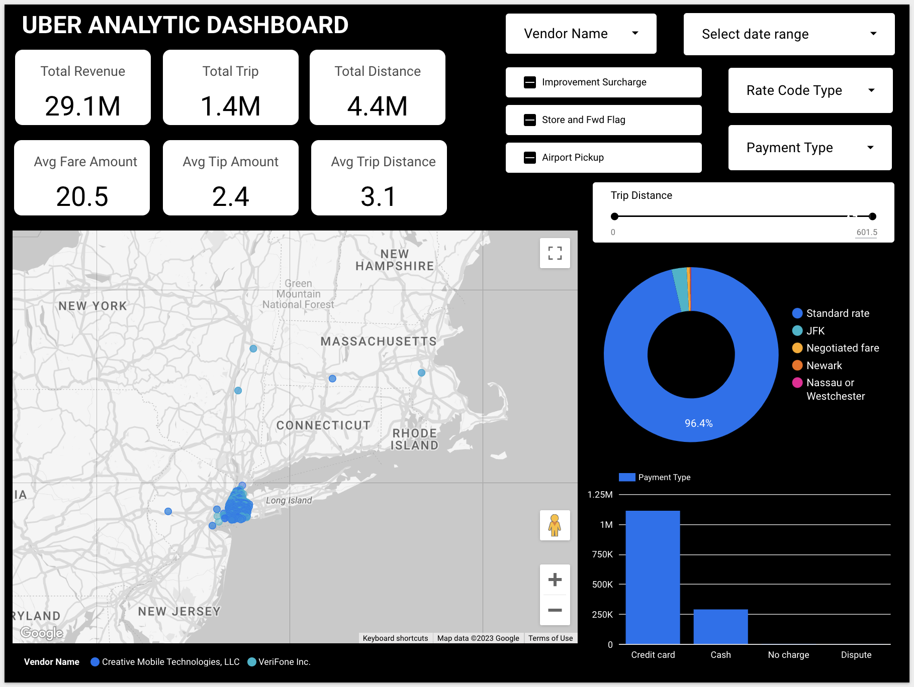
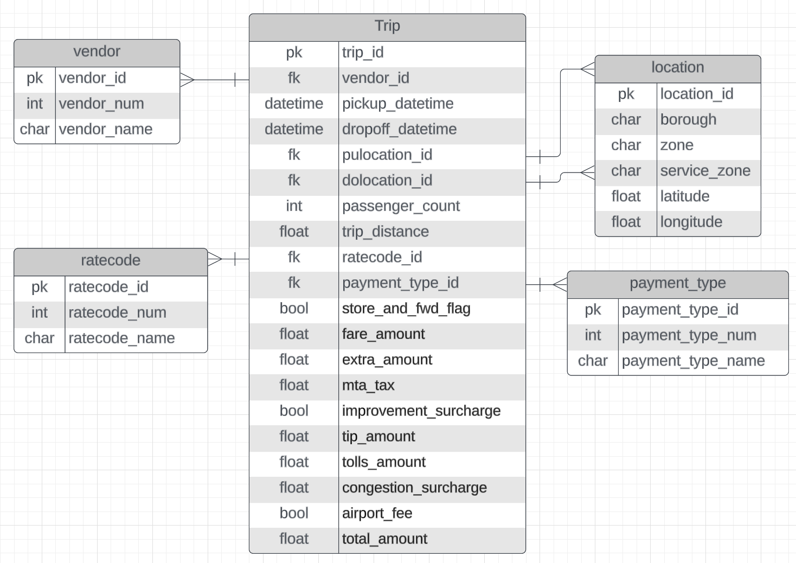
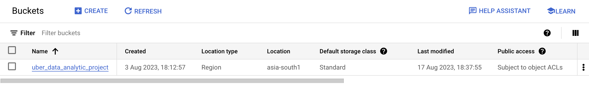
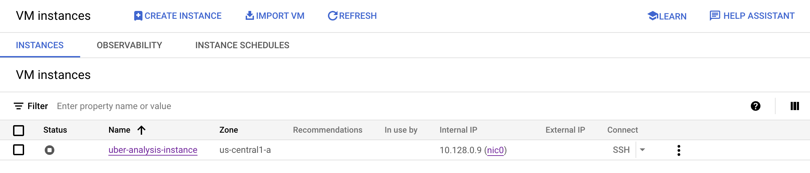
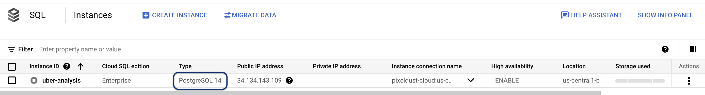

# Analyzing Uber Trip Data

### Objective

To deeply understand Uber trip data from a particular website. We'll use Google Cloud tools like Cloud Stroage, Virtual Machine and SQL Database to process the data. Then, we'll create a user-friendly dashboard using LookerStudio to show the important information. To further enhance user experience, interactive filters will be integrated into the dashboard, enabling users to dynamically modify data parameters and refine visualizations according to specific criteria, thereby facilitating more personalized and insightful data exploration.

<p align="center">

</p>

---

<details>

<summary><h2>Installation</h2></summary>

- The Project based on Python version: **3.10.12**
- Create a virtualenv within your VM instance, activate it, and install all dependencies

    ```
    $ pip install -r requirements.txt
    ```

- In the `uber_analysis/io_config.yaml` file, replace the existing content with `uber_analysis/example_io_config.yaml`. Additionally, include the necessary database credentials.

- In the `cloud-credentials.json` file, remove existing content and replace with your own [Google Cloud credentials](https://developers.google.com/workspace/guides/create-credentials#service-account).

- Run the following command to initiate the project and open a web browser. Enter the external IP address of your VM instance followed by port 6789, for example: `35.249.272.03:6789`. Ensure that ports 22, 80, and 6789 are open in the [firewall](https://cloud.google.com/firewall/docs/using-firewalls) settings.

    ```
    $ mage start uber_analysis
    ```

- Execute the Uber pipeline to generate the necessary data and create a new table based on your specified requirements for analysis. Afterward, develop a dashboard using this data.

</details>

<details>

<summary><h2>Getting Started</h2></summary>

<strong>Step 1: Getting Data: </strong>We'll collect Uber trip information from a special website.

- Download Uber trip raw data from the [Nyc website](https://www.nyc.gov/site/tlc/about/tlc-trip-record-data.page) at any type of year or month, but it must be a <strong>Yellow Taxi Trip</strong>.

- [Kaggle](https://www.kaggle.com/datasets/yzhoukaggle/zone-coordinates-of-nyc-yellow-taxi-trip-records?select=taxi_zone_lookup_coordinates.csv), you can get location data here.

<strong>Step 2: Data Dictionary: </strong>Develop a clear data dictionary to define each data field's attributes.

- Using the given [data dictionary](https://www.nyc.gov/assets/tlc/downloads/pdf/data_dictionary_trip_records_yellow.pdf), we can create our own data structure in [lucid.app](https://lucid.app/), as seen in the figure below.

    <p align="center">
    
    </p>

<strong>Step 3: Start Google Cloud Services</strong>

- **Google Cloud Storage (Bucket):** Create a Google Cloud account, navigate to Cloud Storage, and [create](https://cloud.google.com/storage/docs/creating-buckets) a new bucket to store your data securely.

    <p align="center">
    
    </p>

- **Virtual Machine (VM) Instances:** [Set up](https://cloud.google.com/compute/docs/instances/create-start-instance#console_5) VM instances by accessing the Compute Engine section, where you can configure and launch virtual machines.

    <p align="center">
    
    </p>

- **SQL Database:** Access Google Cloud SQL to [create](https://cloud.google.com/sql/docs/postgres/create-manage-databases) and manage a relational database for structured data storage.

    <p align="center">
    
    </p>

<strong>Step 4: ETL Workflow Implementation:</strong>

- Initiate the Mage application within the virtual machine using the following command:

    ```
    $ mage start <project_name>
    ```

- Either [create]((https://docs.mage.ai/guides/load-api-data)) your own pipeline using Mage AI or duplicate the `uber_analysis` directory from the provided code.

- **Extraction**

    - Collects data from databases, files, APIs, or streams.
    - Identifies relevant data for transfer.
    - Uses full loads or incremental updates.
    - Ensures capturing the most current data.

* **Transformation** 

    - Cleans, enriches, and restructures data.
    - Removes duplicates and handles missing values.
    - Aggregates data and applies business logic.
    - Maintains data quality and consistency.

* **Loading** 

    - Inserts transformed data into a destination system.
    - Maps data fields to destination schema.
    - Utilizes bulk inserts or batch loading.
    - Prepares data for querying and analysis.

**Step 5: Dynamic Dashboard Design:** Create an interactive [LookerStudio](https://lookerstudio.google.com/) dashboard.

<p align="center">

</p>

</details>

### Benefits

**Data Analysis Skills:** Engaging in this project will enhance your data analysis skills as you work with real-world data and implement various data processing techniques.

**Cloud Technology Proficiency:** By utilizing Google Cloud services like Cloud Storage, Virtual Machines, and SQL Database, you'll gain practical experience with cloud infrastructure, which is valuable in today's tech landscape.

**ETL Workflow:** Setting up an ETL (Extract, Transform, Load) workflow using Mage application will teach you how to efficiently process and prepare data for analysis.

**Database Management:** Creating and managing a SQL database using Google Cloud SQL will give you hands-on experience in database administration and data storage.

**Data Visualization:** Designing interactive dashboards using LookerStudio will enable you to present your insights effectively, improving your data visualization skills.

---

### Reference

<details>

<summary><h4>Related Documentation</h3></summary>

- [Mage](https://docs.mage.ai/introduction/overview)

- [Google Cloud Platform](https://cloud.google.com/docs)

</details>

<details>

<summary><h4>Related Video</h4></summary>

- [Uber Data Analytics | End-To-End Data Engineering Project](https://www.youtube.com/watch?v=WpQECq5Hx9g)

- [Google Cloud Platform Tutorial](https://www.youtube.com/watch?v=zBBevSjX9E8&list=PLLhBy6YSIT0A63_RuqW6naWa66xzYVtP5)

- [Looker Studio Tutorial](https://www.youtube.com/watch?v=8cMd1KJAyg8&list=PLNfnAKZ4ZsarFIZHOkbUBPCpEXeHRgt-Y)

</details>

---

<details>

<summary><h2>Advanced Configuration</h2></summary>

<details>

<summary><h3><a href="https://docs.ansible.com/">Ansible</a></h3></summary>

**Installation Process:**

- Begin by installing Ansible using the following pip command:

    ```
    $ pip install ansible
    ```

**File Encryption:**

- To encrypt a file using Ansible Vault, execute the following command:

    ```
    $ ansible-vault encrypt <file_name>
    ```

**File Decryption:**

- To decrypt an encrypted file, use the following command:

    ```
    $ ansible-vault decrypt <file_name>
    ```

</details>

<details>

<summary><h3><a href="http://supervisord.org/index.html">Supervisor</a></h3></summary>

**1: Install Supervisor:**

- Open a terminal and run the following command to install Supervisor:

    ```
    sudo apt install supervisor
    ```

**2: Create Configuration File:**

- Create a new configuration file, such as `/etc/supervisor/conf.d/uber-analysis.conf`, using your preferred text editor. Inside this file, define the process configuration:

    ```
    [program:uber-analysis]
    directory=/home/aadilkadiwal4277/uber-analysis/
    command=/path/to/mage start uber_analysis
    autostart=true
    autorestart=true
    stderr_logfile=/var/log/uber-analysis.err.log
    stdout_logfile=/var/log/uber-analysis.out.log
    logfile_maxbytes=50MB
    ```

Replace `/path/to/uber-analysis` with the actual path to the uber_analysis directory and `/path/to/mage` with the actual path to the mage command.

**3: Reload Supervisor:**

- After creating the configuration file, reload Supervisor to read the new configuration:

    ```
    $ sudo supervisorctl reread
    $ sudo supervisorctl update
    ```

**4: Start and Manage the Process:**

- You can now start, stop, or restart your process using Supervisor:

    - Start the process:

        ```
        $ sudo supervisorctl start uber-analysis
        ```

    - Stop the process:

        ```
        $ sudo supervisorctl stop uber-analysis
        ```

    - Restart the process:

        ```    
        $ sudo supervisorctl restart uber-analysis
        ```

    - View process status:

        ```
        $ sudo supervisorctl status
        ```

**5: Monitor Logs:**

- Supervisor logs for this process will be stored in the log files specified in the configuration: `/var/log/uber-analysis.err.log` for standard error and `/var/log/uber-analysis.out.log` for standard output.

</details>

<details>

<summary><h3><a href="https://www.docker.com/">Docker</a></h3></summary>

**1: Install Docker:**

- Open a terminal and run the following command to install Docker on Ubuntu 22.04:

    ```
    $ sudo apt install apt-transport-https ca-certificates curl software-properties-common
    $ curl -fsSL https://download.docker.com/linux/ubuntu/gpg | sudo apt-key add -
    $ sudo add-apt-repository "deb [arch=amd64] https://download.docker.com/linux/ubuntu $(lsb_release -cs) stable"
    $ sudo apt-get update
    $ sudo apt-get install docker-ce -y
    $ sudo systemctl start docker
    $ sudo systemctl enable docker
    $ sudo groupadd docker
    $ sudo usermod -aG docker ubuntu
    ```

**2: Build the Docker Image:**

-  Use the Dockerfile to build the Docker image. Run this command in the same directory as your Dockerfile:

    ```
    $ docker build -t uber-analysis:0.1 .
    ```

**3: Run a Docker Container**

- To run a container from the image you built, use the docker run command:

    ```
    $ docker run -p 6789:6789 uber-analysis:0.1
    ```

**4: Push Image to Docker Hub**

- To push your Docker image to Docker Hub, you need to tag it with your Docker Hub username and repository name, and then use the docker push command:

    ```
    $ docker tag uber-analysis:0.1 aadilkadiwal/uber-analysis:prod
    $ docker push aadilkadiwal/uber-analysis:prod
    ```

</details>

</details>