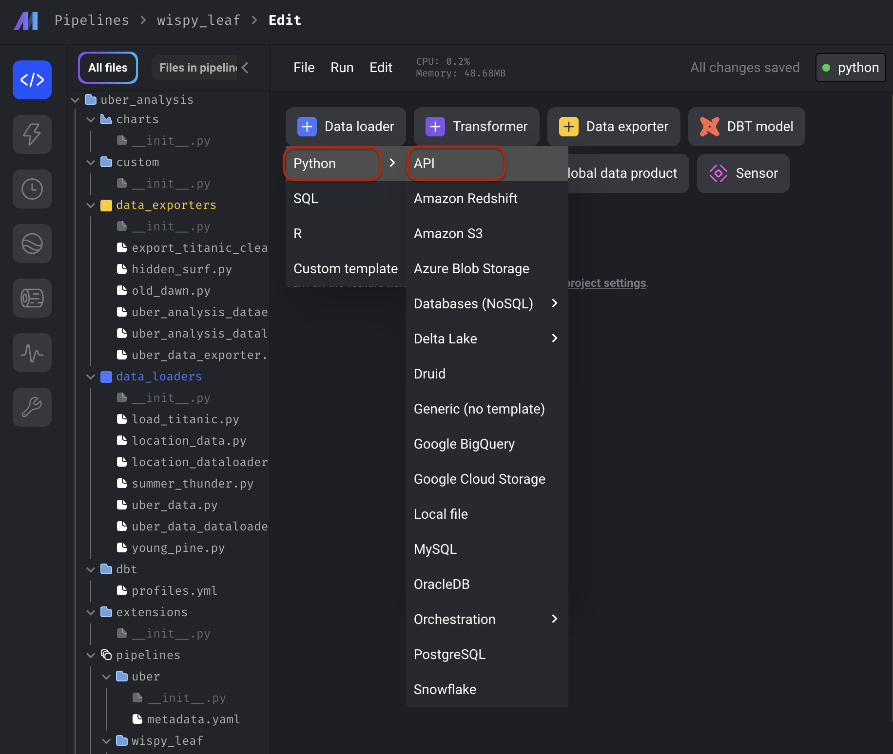
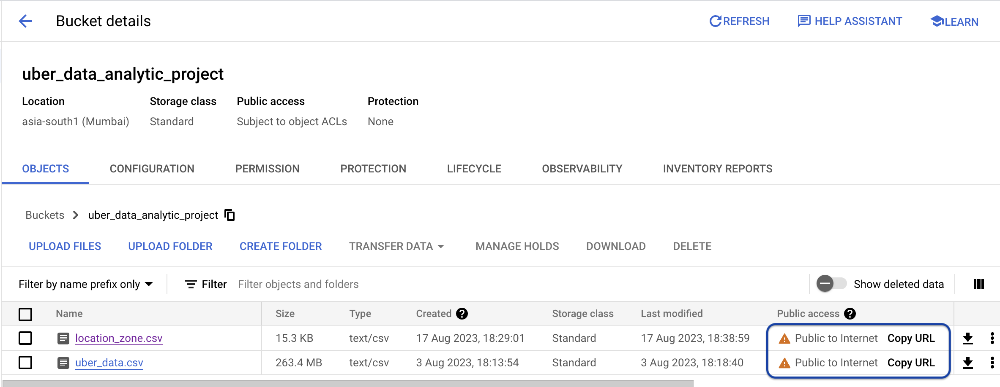
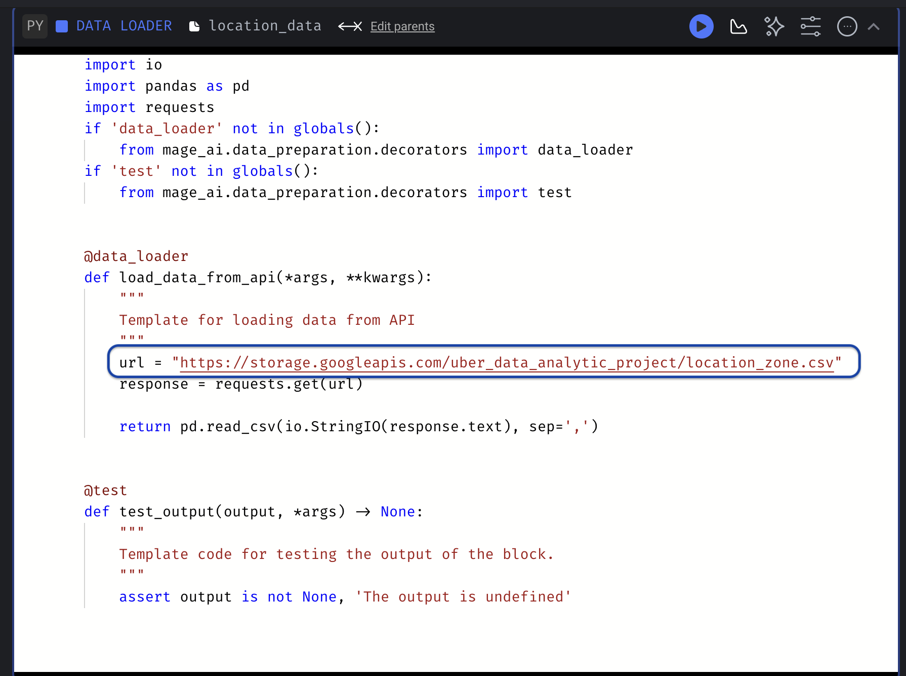
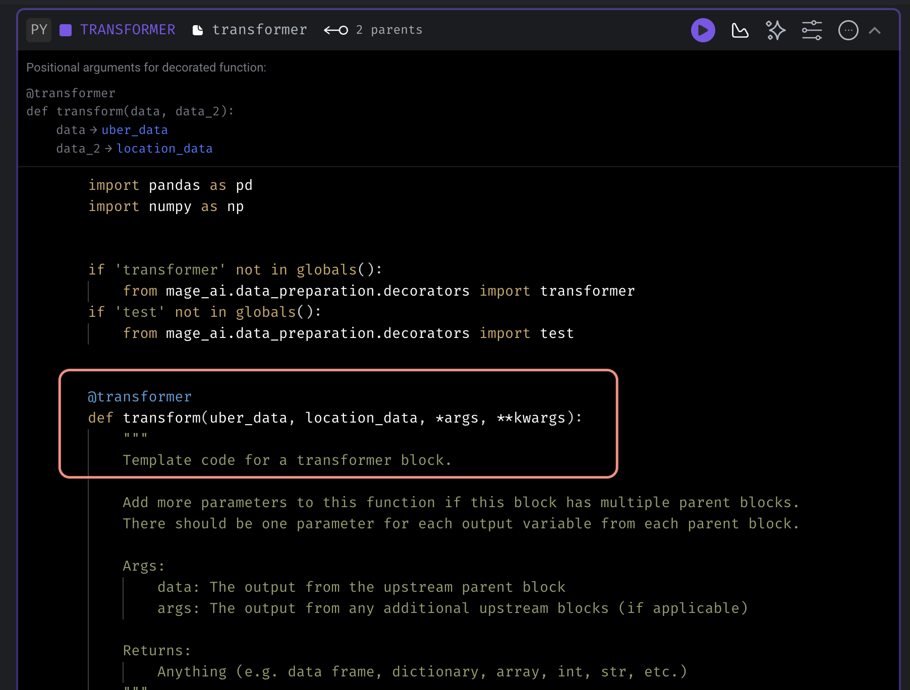
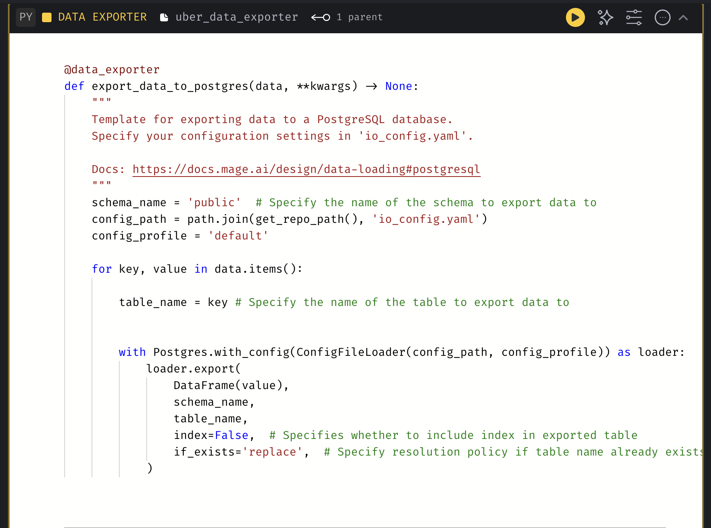
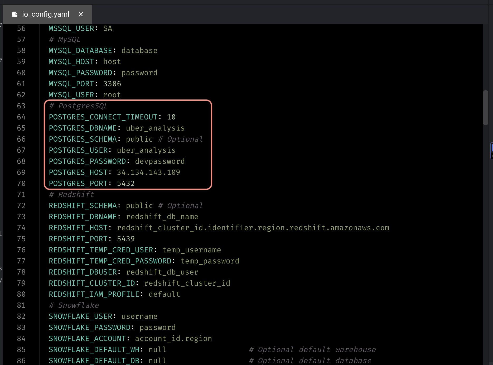
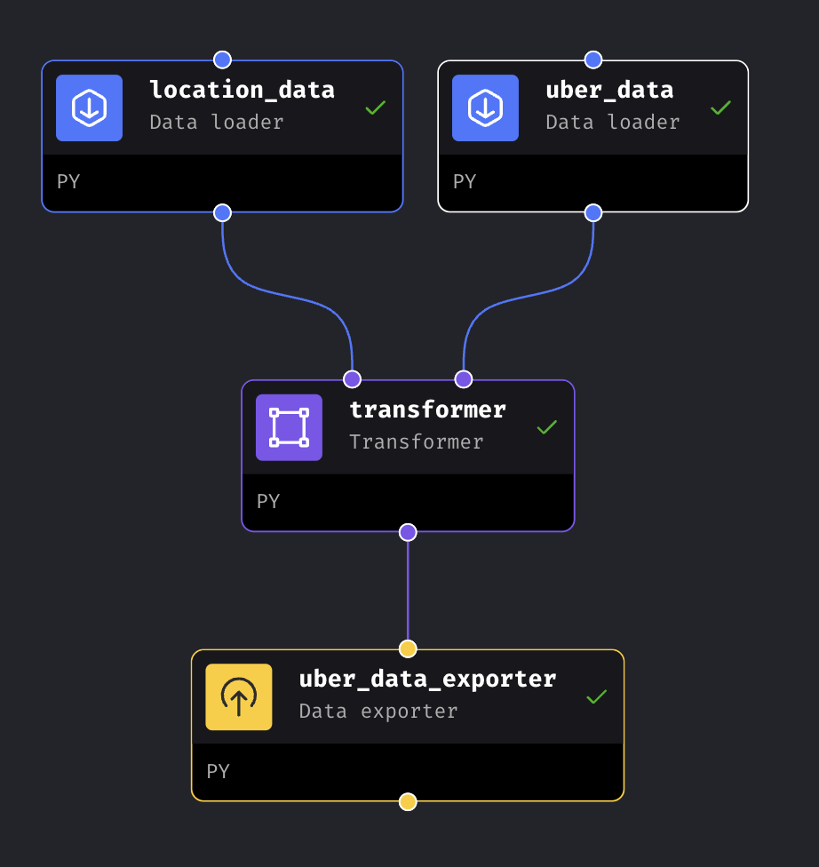

# Analyzing Uber Trip Data

### Objective

To deeply understand Uber trip data from a particular website. We'll use Google Cloud tools like Cloud Stroage, Virtual Machine and SQL Database to process the data. Then, we'll create a user-friendly dashboard using LookerStudio to show the important information.

---

### Getting Started

<strong>Step 1: Getting Data: </strong>We'll collect Uber trip information from a special website.

* Download Uber trip raw data from the [Nyc website](https://www.nyc.gov/site/tlc/about/tlc-trip-record-data.page) at any type of year or month, but it must be a <strong>Yellow Taxi Trip</strong>.

* [Kaggle](https://www.kaggle.com/datasets/yzhoukaggle/zone-coordinates-of-nyc-yellow-taxi-trip-records?select=taxi_zone_lookup_coordinates.csv), you can get location data here.

<strong>Step 2: Data Dictionary: </strong>Develop a clear data dictionary to define each data field's attributes.

* Using the given [data dictionary](https://www.nyc.gov/assets/tlc/downloads/pdf/data_dictionary_trip_records_yellow.pdf), we can create our own data structure in [lucid.app](https://lucid.app/), as seen in the figure below.

    <p align="center">
    
    </p>

<strong>Step 3: Start Google Cloud Services</strong>

* **Google Cloud Storage (Bucket):** Create a Google Cloud account, navigate to Cloud Storage, and [create](https://cloud.google.com/storage/docs/creating-buckets) a new bucket to store your data securely. Make sure the bucket settings [allow](https://cloud.google.com/storage/docs/access-control/making-data-public) data access.

<p align="center">

</p>

* **Virtual Machine (VM) Instances:** [Set up](https://cloud.google.com/compute/docs/instances/create-start-instance#console_5) VM instances by accessing the Compute Engine section, where you can configure and launch virtual machines.

    <p align="center">
    
    </p>

    * Additionally, ensure you have the necessary packages by running the following commands:

        ```
        $ sudo apt update
        $ sudo apt upgrade
        $ sudo apt-get install vim
        $ sudo apt install python3
        $ sudo apt install python3-pip
        $ pip install pandas
        $ pip install mage-ai
        $ pip install google-cloud
        $ pip install psycopg2-binary
        $ pip install sshtunnel
        ```

* **SQL Database:** Access Google Cloud SQL to [create](https://cloud.google.com/sql/docs/postgres/create-manage-databases) and manage a relational database for structured data storage.

<p align="center">

</p>

<strong>Step 4: ETL Workflow Implementation:</strong>

* Initiate the Mage application within the virtual machine using the following command:

    ```
    $ mage start uber_analysis
    ```

* [Create](https://docs.mage.ai/tutorials/load-api-data#1-create-new-pipeline) a new Standard(batch) pipeline.

* **Extraction**

    * [Create](https://docs.mage.ai/design/blocks/data-loader) a data loader for extracting data.
    
        <p align="center">
        
        </p>

    * Copy the Google Bucket file URL.

        <p align="center">
        
        </p>

    * Paste it into the **'url'** variable within the data loader.

        <p align="center">
        
        </p>    
        
* **Transformation:** 

    * [Create](https://docs.mage.ai/design/blocks/transformer) a transformer, paste the code of the **'uber.py'** file into the transform function. Retrieve the raw data from the data loader and return it in the form of a dictionary.

        <p align="center">
        
        </p>  


* **Loading:** 

    * [Create](https://docs.mage.ai/design/blocks/data-exporter) a new Data Loader and adjust the pre-defined code as below image.

        <p align="center">
        
        </p>  

    * [Create](https://support.google.com/appsheet/answer/10107301?hl=en) a Database within your Google SQL instance. Establish a connection to the database by configuring the **'io.config.yaml'** file.

        <p align="center">
        
        </p>      

* The ETL workflow's overall pipeline will appear as follows and run these pipeline.

    <p align="center">
    
    </p>  

**Step 5: Dynamic Dashboard Design:** Create an interactive [LookerStudio](https://lookerstudio.google.com/) dashboard.

<p align="center">

</p>
